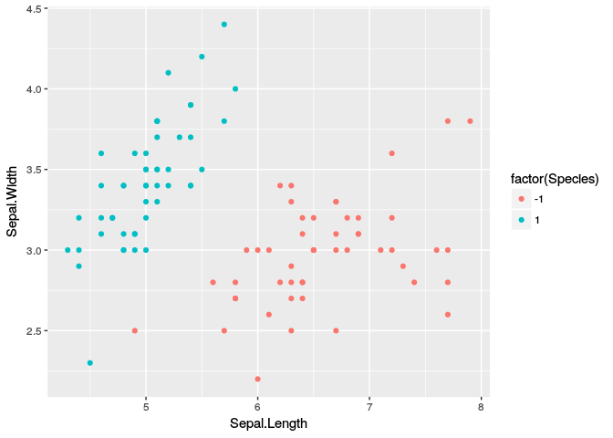
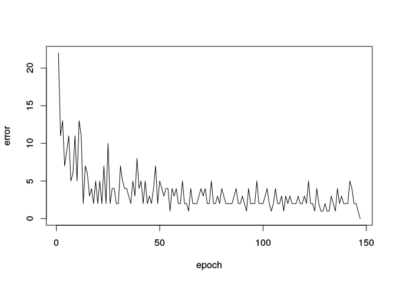
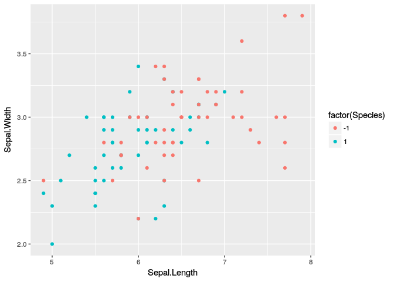

readme
================
Srikanth KS
10 January 2017

ptron
-----

A perceptron implementation in `R` with bells ans whistles.

Example
-------

``` r
# example 1 ----
library("tidyverse")
```

    ## Loading tidyverse: ggplot2
    ## Loading tidyverse: tibble
    ## Loading tidyverse: tidyr
    ## Loading tidyverse: readr
    ## Loading tidyverse: purrr
    ## Loading tidyverse: dplyr

    ## Conflicts with tidy packages ----------------------------------------------

    ## filter(): dplyr, stats
    ## lag():    dplyr, stats

``` r
iris_mod1 <- iris %>%
  select(Sepal.Length, Sepal.Width, Species) %>%
  filter(Species != "versicolor") %>%
  mutate(Species = ifelse(Species == "setosa", 1, -1))

# observe that this is a linearly separable case
# the two points (2.5, 5) delay the training
qplot(Sepal.Length, Sepal.Width, data = iris_mod1, col = factor(Species))
```



``` r
temp1 <- ptron(iris_mod1[,1:2] %>% as.matrix
                   , as.integer(iris_mod1[[3]])
                   , errorthres = 0
                   )
```

    ## Loading required package: assertthat

    ## 
    ## Attaching package: 'assertthat'

    ## The following object is masked from 'package:tibble':
    ## 
    ##     has_name

    ## Loading required package: rstackdeque

    ## Done! Converged at 147 epochs to error = 0



``` r
predict(temp1, iris_mod1[,-3] %>% as.matrix)
```

    ## Warning in predict.ptron(temp1, iris_mod1[, -3] %>% as.matrix): predictions
    ## from an unconverged model might not be correct.

    ##   [1]  1  1  1  1  1  1  1  1  1  1  1  1  1  1  1  1  1  1  1  1  1  1  1
    ##  [24]  1  1  1  1  1  1  1  1  1  1  1  1  1  1  1  1  1  1  1  1  1  1  1
    ##  [47]  1  1  1  1 -1 -1 -1 -1 -1 -1 -1 -1 -1 -1 -1 -1 -1 -1 -1 -1 -1 -1 -1
    ##  [70] -1 -1 -1 -1 -1 -1 -1 -1 -1 -1 -1 -1 -1 -1 -1 -1 -1 -1 -1 -1 -1 -1 -1
    ##  [93] -1 -1 -1 -1 -1 -1 -1 -1

``` r
# example 2 ----
iris_mod2 <- iris %>%
  select(Sepal.Length, Sepal.Width, Species) %>%
  filter(Species != "setosa") %>%
  mutate(Species = ifelse(Species == "versicolor", 1, -1))

# observe that this is NOT a linearly separable case
qplot(Sepal.Length, Sepal.Width, data = iris_mod2, col = factor(Species))
```



``` r
temp2 <- ptron(iris_mod2[,1:2] %>% as.matrix
                   , iris_mod2[[3]] %>% as.integer
                   )
```

    ## Caveat! Failed to converge after 1000 epochs with errorthres = 1, eta = 1, variation = 0


``` r
# how good is the model
caret::confusionMatrix(iris_mod2[[3]]
                       , predict(temp2, iris_mod2[,-3] %>% as.matrix)
                       )
```

    ## Warning in predict.ptron(temp2, iris_mod2[, -3] %>% as.matrix): predictions
    ## from an unconverged model might not be correct.

    ## Confusion Matrix and Statistics
    ## 
    ##           Reference
    ## Prediction -1  1
    ##         -1 43  7
    ##         1  25 25
    ##                                           
    ##                Accuracy : 0.68            
    ##                  95% CI : (0.5792, 0.7698)
    ##     No Information Rate : 0.68            
    ##     P-Value [Acc > NIR] : 0.547703        
    ##                                           
    ##                   Kappa : 0.36            
    ##  Mcnemar's Test P-Value : 0.002654        
    ##                                           
    ##             Sensitivity : 0.6324          
    ##             Specificity : 0.7812          
    ##          Pos Pred Value : 0.8600          
    ##          Neg Pred Value : 0.5000          
    ##              Prevalence : 0.6800          
    ##          Detection Rate : 0.4300          
    ##    Detection Prevalence : 0.5000          
    ##       Balanced Accuracy : 0.7068          
    ##                                           
    ##        'Positive' Class : -1              
    ##
